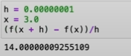
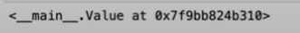

# Notes made for the [video](https://www.youtube.com/watch?v=VMj-3S1tku0&list=PLAqhIrjkxbuWI23v9cThsA9GvCAUhRvKZ), hopefully it helps you understand

Credit: Andrej Karpathy
His github [here](https://github.com/karpathy)

### Autograd engine:
- -> Automatic Gradient
- Implements backpropagation:
    - iteratively tune weights of neural network to minimize loss function
    - improves accuracy of network
- Neural networks are just mathematical functions & calculations

### About Micrograd
- micrograd is technically all you need to train networks
- However, it isn't really much of complex coding ( basic python + a bit of calculus kekw )
- All you need to understand neural networks; Everything else is efficiency
- Fundamentals

### Other
- No actual math in Neural Network codes
- Just to know what derivative is measuring, aka. instantaneous slope



### the code section + Processes and more notes

This is the skeleton of the Value class; Keeps track of a single data value.
```python
class Value:
    
    def __init__(self, data):
        self.data = data
    
    def __repr__(self):
        return f"Value(data={self.data})"
a = Value(2.0)
print(a)
```
Therefore running it with 
```sh
python engine.py
```
gets us the answer of Value(data=2.0).
The __repr__ method is making python printing the results in a nicer way, unless you want torture responses like this:



### However, doing operations on Value objects is not doable yet, like adding Value(a) with Value(b)

So we need to add a way to do operations
```python
class Value:
    
    def __init__(self, data):
        self.data = data
    
    def __repr__(self):
        return f"Value(data={self.data})"
    
    def __add__(self, other):
        output = Value(self.data + other.data)
        return output

a = Value(2.0)
b = Value(-3.0)
print(a+b)
```
In here, python will perform this:
```python
a.__add__(b)
```
this giving us a new Value object with the new number: Value(data=-1.0)

Same thing for other operations, in this case implementing multiplication:
```python
class Value:
    
    def __init__(self, data):
        self.data = data
    
    def __repr__(self):
        return f"Value(data={self.data})"
    
    def __add__(self, other):
        output = Value(self.data + other.data)
        return output

    def __mul__(self, other):
        output = Value(self.data * other.data)
        return output

a = Value(2.0)
b = Value(-3.0)
c = Value(10.0)
d = a * b + c
# (a__mul__(b)).__add__(c)
print(d)
```
Now the only thing that is missing is the connective tissue of the expression
as we need to keep the expression graphs. What we need is pointers that shows what Values makes what other Values. In this case implementing a new variable called _children:
```python
class Value:
    # by default __children will be an empty tuple
    def __init__(self, data, _children=()):
        self.data = data
        # for efficiency, it'll be in a set
        self._prev = set(_children)
    
    def __repr__(self):
        return f"Value(data={self.data})"
    # when we do the operations, we are feeding in the children of the value
    def __add__(self, other):
        output = Value(self.data + other.data, (self, other))
        return output

    def __mul__(self, other):
        output = Value(self.data * other.data, (self, other))
        return output

a = Value(2.0)
b = Value(-3.0)
c = Value(10.0)
d = a * b + c
# _children will be empty, and _prev will be an empty set
print(d._prev)
# {Value(data=-6.0), Value(data=10.0)}
```
Now we know the children of every single value, but don't know what operation created it. Therefore needed another element _op:
```python
class Value:

    def __init__(self, data, _children=(), _op=""):
        self.data = data
        self._prev = set(_children)
        self._op = _op
    
    def __repr__(self):
        return f"Value(data={self.data})"

    #Telling us which operation made the children
    def __add__(self, other):
        output = Value(self.data + other.data, (self, other), '+')
        return output

    def __mul__(self, other):
        output = Value(self.data * other.data, (self, other), '*')
        return output

a = Value(2.0)
b = Value(-3.0)
c = Value(10.0)
d = a * b + c
print(d._op)
#'+', caused by addition of (a*b) + c
```
***Have full mathematical expression & building data structure, and now we know how each value is made, by what expression and from what other Values***

We want a nice way to visualize the stuff we are building out now, just to visually see things:
```python
from graphviz import Digraph

def trace(root):
    #builds a set of node & edges in a graph
    nodes, edges = set(), set()
    def build(v):
        nodes.add(v)
        for child in v._prev:
            edges.add((child, v))
            build(child)
    build(root)
    return nodes, edges

def draw_dot(root):
    dot = Digraph(format='svg', graph_attr = {'rankdir': 'LR'}) #LR = Left -> Right

    nodes, edges = trace(root) # building a graph of nodes and edges
    for n in nodes:
        uid = str(id(n))
        # make a rectangular "record" node for any value in the graph
        dot.node(name = uid, label = "{ %s | data %.4f }" % (n.label, n.data), shape='record')
        if n._op:
            # if this value is a result of an operation make an _op node
            dot.node(name = uid + n._op, label = n._op)
            # connect the op node
            dot.edge(uid + n._op, uid)
    
    for x, y in edges:
        # connect x to the op node of y
        dot.edge(str(id(x)), str(id(y)) + y._op)
    
    return dot
```
Of course, labels are needed:
```python
class Value:

    def __init__(self, data, _children=(), _op='', label=''):
        self.data = data
        self._prev = set(_children)
        self._op = _op
        self.label = label
    
    def __repr__(self):
        return f"Value(data={self.data})"

    def __add__(self, other):
        output = Value(self.data + other.data, (self, other), '+')
        return output

    def __mul__(self, other):
        output = Value(self.data * other.data, (self, other), '*')
        return output

a = Value(2.0, label='a')
b = Value(-3.0, label='b')
c = Value(10.0, label='c')
e = a * b; e.label='e'
d = e + c; d.label='d'
f = Value(-2.0, label='f')
L = d * f; L.label='L'
# L = -8.0
```

## Time for some backpropagation action
We run back from L and calculate the gradient along those intermediate values.
- Compute the derivative of the node d(L) (respect to L)
- L d(L) = 1
- Derivative of L with respect to f, respect to d, etc.
- Derivative of output with respect to leaf nodes, which will eventually be weights of a neural network, whilst other leaf nodes will be data, which is not oftenly used

In neural networks, we are interested for the derivative of the loss function with respect to the weights of a NN. (*I'll be calling neural networks NN from now on*)

- cannot really go for derivative of L with respect to data cause data is fixed
- However weights will be iterated
- continue 30:49 

